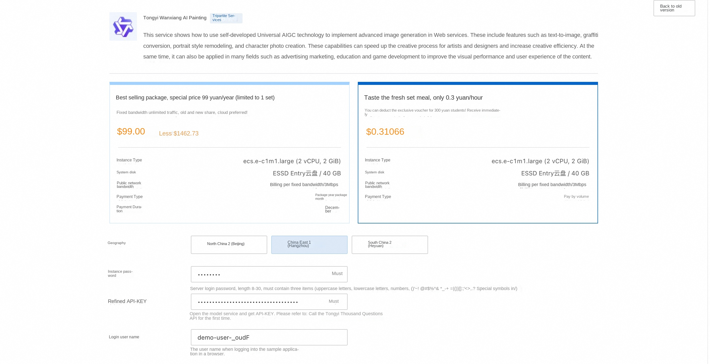
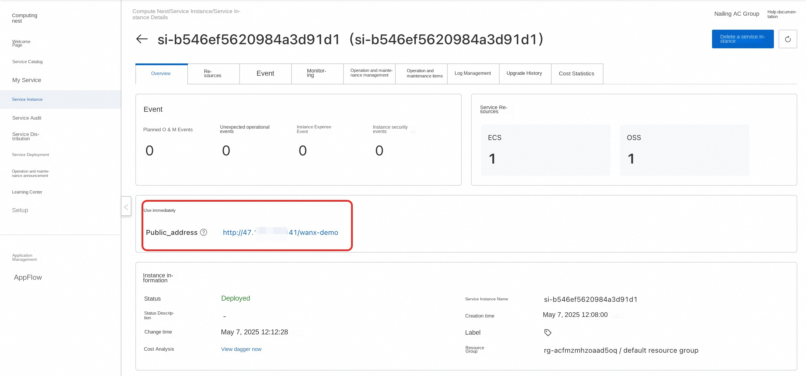
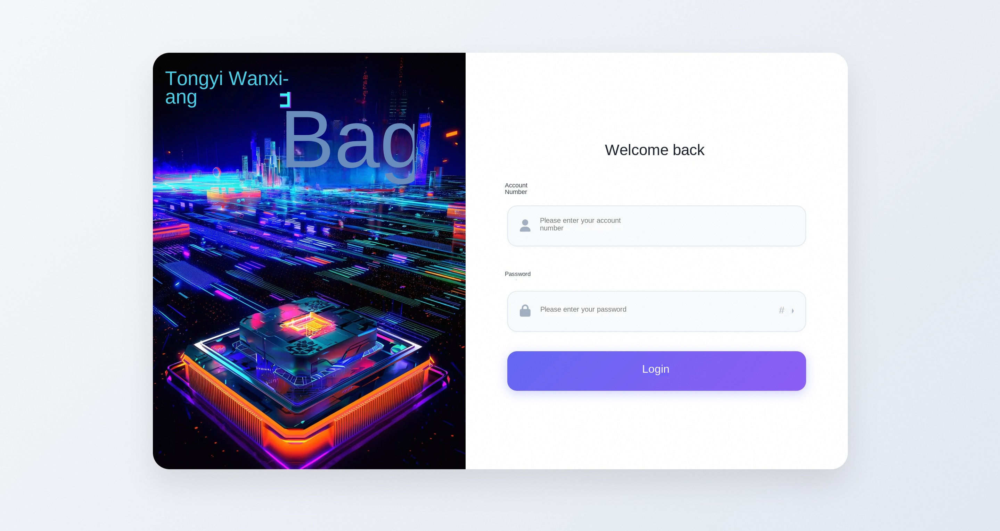

## Introduction
This service uses the universal AIGC technology to implement advanced image generation in Web services. These include features such as text-to-image, graffiti conversion, portrait style remodeling, and character photo creation. These capabilities can speed up the creative process for artists and designers and increase creative efficiency. At the same time, it can also be applied in many fields such as advertising marketing, education and game development to improve the visual performance and user experience of the content. Through Tongyi Wanxiang, users can easily transform text descriptions or simple sketches into high-quality images, realize the customization of personalized visual content, and meet the needs of social media, e-commerce and e-entertainment industries.

## Billing Description
The cost of this service on Alibaba Cloud is mainly related:
* Specifications of the selected GPU cloud server
* Disk Capacity
* Internet Bandwidth

Billing method: pay by volume (hour) or package year and month
The estimated cost can be seen in real time when the instance is created.

Refined model call cost:
* When you first open the Hundred Refinement, the platform will automatically issue the exclusive free quota for newcomers of each model for you. For details, please refer to [Hundred Refinement Newcomer Free Quota](https://help.aliyun.com/zh/model-studio/new-free-quota?spm=a2c4g.11186623.help-menu-2400256.d_4_1.6dea55efFQCijR#view-quota).

## Permissions required for RAM accounts

| Permission policy name | Comment |
| ------------------------------------- | -------------------- |
| AliyunECSFullAccess | Permissions for managing ECS instances |
| AliyunVPCFullAccess | Permissions for managing a VPC |
| AliyunROSFullAccess | Manage permissions for Resource Orchestration Service (ROS) |
| AliyunComputeNestUserFullAccess | Manage user-side permissions for the compute nest service (ComputeNest) |

## Deployment Services

1. Click [Deployment Link](https://computenest.console.aliyun.com/service/simple/deploy?ServiceId=service-08d769910fc844bc84ce) to enter the service instance deployment interface, and fill in the parameters according to the interface prompt.

2. After confirming the order is completed, click **Create Now**.
3. Wait for the deployment to complete and enter the service instance details.

4. Click the public access address to use the service.

