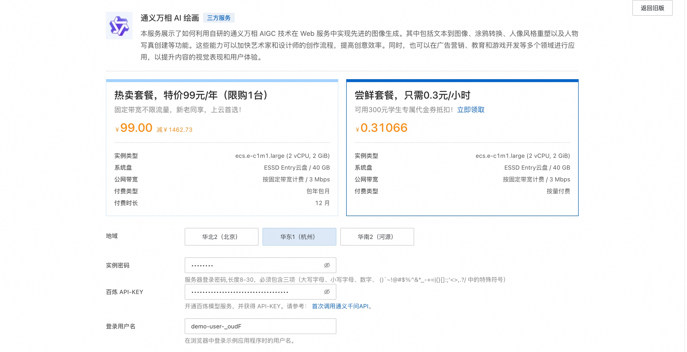
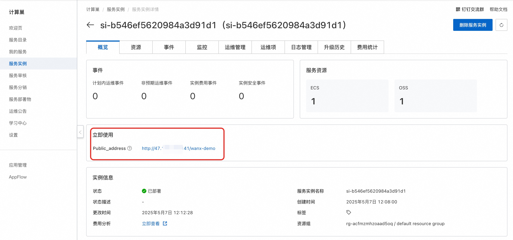
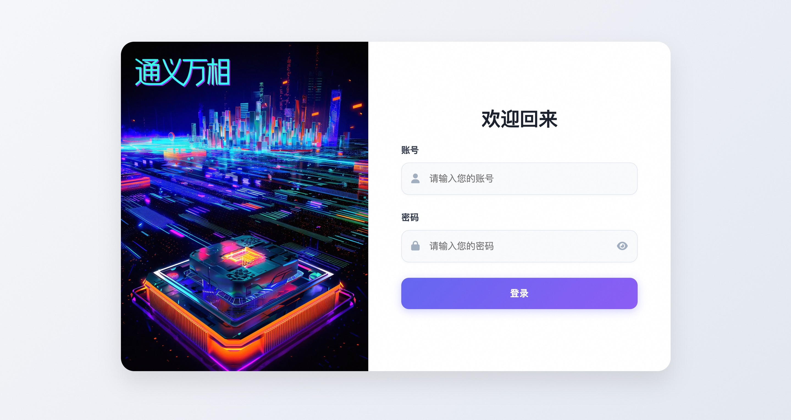

## 简介
本服务使用通义万相 AIGC 技术在 Web 服务中实现先进的图像生成。其中包括文本到图像、涂鸦转换、人像风格重塑以及人物写真创建等功能。这些能力可以加快艺术家和设计师的创作流程，提高创意效率。同时，也可以在广告营销、教育和游戏开发等多个领域进行应用，以提升内容的视觉表现和用户体验。通过通义万相，用户可以轻松将文字描述或简单草图转化为高质量图像，实现个性化视觉内容的定制，满足社交媒体、电子商务和电子娱乐产业的需求。

## 计费说明
本服务在阿里云上的费用主要涉及：
* 所选GPU云服务器的规格
* 磁盘容量
* 公网带宽

计费方式：按量付费（小时）或包年包月
预估费用在创建实例时可实时看到。

百炼模型调用费用:
* 当您首次开通百炼时，平台会自动为您发放各模型的新人专属免费额度，详情请看[百炼新人免费额度](https://help.aliyun.com/zh/model-studio/new-free-quota?spm=a2c4g.11186623.help-menu-2400256.d_4_1.6dea55efFQCijR#view-quota)。

## RAM账号所需权限

| 权限策略名称                          | 备注                     |
|---------------------------------|------------------------|
| AliyunECSFullAccess             | 管理云服务器服务（ECS）的权限       |
| AliyunVPCFullAccess             | 管理专有网络（VPC）的权限         |
| AliyunROSFullAccess             | 管理资源编排服务（ROS）的权限       |
| AliyunComputeNestUserFullAccess | 管理计算巢服务（ComputeNest）的用户侧权限 |

## 部署服务

1. 单击[部署链接](https://computenest.console.aliyun.com/service/simple/deploy?ServiceId=service-08d769910fc844bc84ce)，进入服务实例部署界面，根据界面提示，填写参数。
    

2. 确认订单完成后点击**立即创建**。
3. 等待部署完成后进入服务实例详情。
    

4. 点击公网访问地址使用服务。
    
